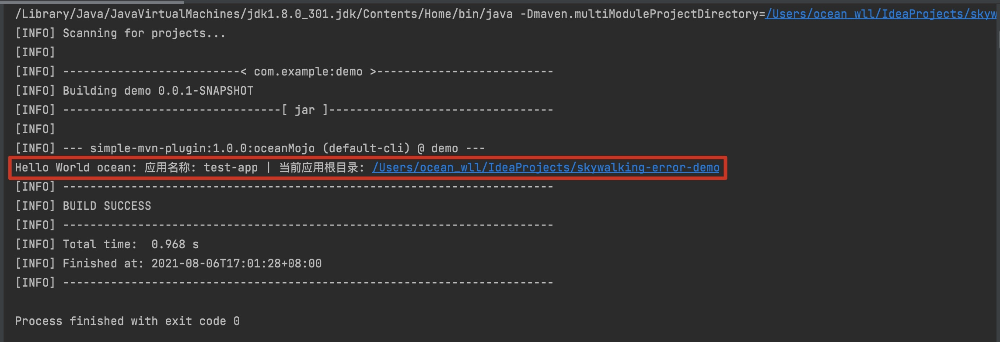

# simple-mvn-plugin

### 自定义插件实现：

　　自定义Mojo需要继承 AbstractMojo 这个抽象类，并实现了 execute() 方法，该方法就是用来定义这个 Mojo 具体操作内容，我们只需要根据自己的需要来编写自己的实现即可。那么Maven 如何知道这是一个 Mojo 而不是一个普通的 Java 类呢？ Mojo 的查找机制：在处理源码的时候，plugin-tools 会把使用了 @Mojo 注解或 Javadoc 里包含 @goal 注释的类来当作一个 Mojo 类。我们这里使用 @Mojo 注解来进行声明。

## 1.导入依赖：

```java
<?xml version="1.0" encoding="UTF-8"?>
<project xmlns="http://maven.apache.org/POM/4.0.0"
         xmlns:xsi="http://www.w3.org/2001/XMLSchema-instance"
         xsi:schemaLocation="http://maven.apache.org/POM/4.0.0 http://maven.apache.org/xsd/maven-4.0.0.xsd">
    <modelVersion>4.0.0</modelVersion>

    <groupId>pers.ocean</groupId>
    <artifactId>simple-mvn-plugin</artifactId>
    <version>1.0.0</version>

    <properties>
        <maven.compiler.source>8</maven.compiler.source>
        <maven.compiler.target>8</maven.compiler.target>
    </properties>

    <!--打包方式-->
    <packaging>maven-plugin</packaging>
    <dependencies>
        <!--使用doc的方式-->
        <dependency>
            <groupId>org.apache.maven</groupId>
            <artifactId>maven-plugin-api</artifactId>
            <version>3.8.1</version>
        </dependency>
        <dependency><!--使用注解的方式-->
            <groupId>org.apache.maven.plugin-tools</groupId>
            <artifactId>maven-plugin-annotations</artifactId>
            <version>3.6.1</version>
            <scope>provided</scope>
        </dependency>
    </dependencies>
    <build>
        <plugins>
            <plugin>
                <groupId>org.apache.maven.plugins</groupId>
                <artifactId>maven-plugin-plugin</artifactId>
                <version>3.5.2</version>
                <!-- 插件执行命令前缀 -->
                <configuration>
                    <goalPrefix>ocean</goalPrefix>
                    <skipErrorNoDescriptorsFound>true</skipErrorNoDescriptorsFound>
                </configuration>
            </plugin>
            <plugin>
                <groupId>org.springframework.boot</groupId>
                <artifactId>spring-boot-maven-plugin</artifactId>
            </plugin>
            <!-- 编码和编译和JDK版本 -->
            <plugin>
                <groupId>org.apache.maven.plugins</groupId>
                <artifactId>maven-compiler-plugin</artifactId>
                <configuration>
                    <source>1.8</source>
                    <target>1.8</target>
                </configuration>
            </plugin>
        </plugins>
    </build>

</project>
```

## 2.Mojo实现类：

```java
import org.apache.maven.plugin.AbstractMojo;
import org.apache.maven.plugin.MojoExecutionException;
import org.apache.maven.plugin.MojoFailureException;
import org.apache.maven.plugins.annotations.LifecyclePhase;
import org.apache.maven.plugins.annotations.Mojo;
import org.apache.maven.plugins.annotations.Parameter;

/**
 * @Description mojo类
 * @Author ocean_wll
 * @Date 2021/8/6 4:56 下午
 */
// mojo注解就是maven插件的注解
// 后面配置的是生命周期，我这里配置了CLEAN，即默认是打包时候执行本插件（这个可以在pom文件指定）
@Mojo(name = "oceanMojo", defaultPhase = LifecyclePhase.CLEAN)
public class OceanMojo extends AbstractMojo {

    // 配置的是本maven插件的配置，在pom使用configration标签进行配置 property就是名字，
    // 在配置里面的标签名字。在调用该插件的时候会看到
    @Parameter(property = "application")
    private String application;

    @Parameter(property = "sourceFolderPath")
    private String sourceFolderPath;

    @Override
    public void execute() throws MojoExecutionException, MojoFailureException {
        System.out.printf("Hello World ocean: 应用名称: %s | 当前应用根目录: %s%n",
                application,
                sourceFolderPath);
    }
}

```

## 3. 执行 mvn install 。成功即可在maven仓库下看到该jar

## 4.创建一个新的 maven 工程，依赖如下：

```java
    <build>
        <plugins>
            <plugin>
                <!--引入刚刚的插件依赖-->
                <groupId>pers.ocean</groupId>
                <artifactId>simple-mvn-plugin</artifactId>
                <version>1.0.0</version>
                <executions>
                    <execution>
                        <goals>
                            <goal>oceanMojo</goal>
                        </goals>
                        <phase>clean</phase>
                    </execution>
                </executions>
                <!-- 这里加入的是相关参数，这些参数必须跟插件实现里面的属性保持一致 -->
                <configuration>
                    <application>test-app</application><!-- 当前应用名称 -->
                    <sourceFolderPath>${basedir}</sourceFolderPath><!-- 当前应用根目录 -->
                </configuration>
            </plugin>
        </plugins>
    </build>
```

## 验证



